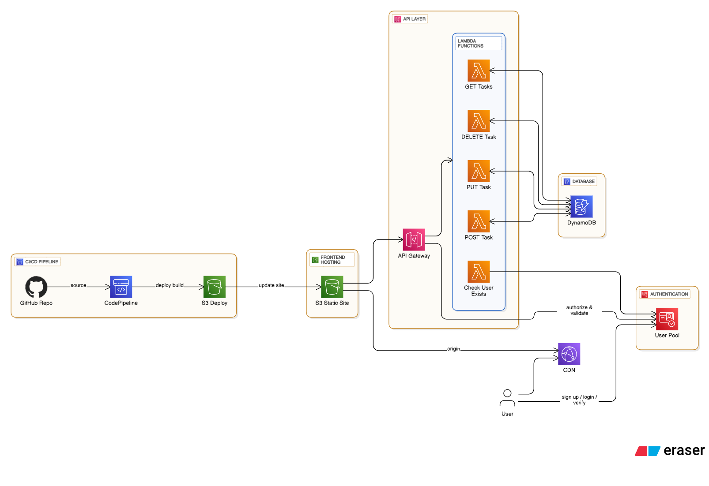

# TaskMate 

TaskMate is a simple full stack Task Manager built on HTML, CSS, Javascript and incorporates a wide variety of AWS services for a serverless task manager web app!

## AWS Architecture

- Amazon Cognito for user sign up, sign in, verification, authentication, forgot password, and managing users
- API Gateway and Lambda for a serverless backend to retrieve tasks, update tasks, create tasks, and delete tasks
- API Gateway and Lambda to check if user exists in the database as well
- DynamoDB for task storage (Database)
- S3 for static website hosting and storage of files
- Cloudfront for global content delivery and distribution. Also a secure https url.
- AWS CodePipleine for CI/CD with my GitHub and S3 Bucket

## Cloudfront URL/URL for the Task Manager!
https://d216srow1s0soq.cloudfront.net/

## Signing Up
- When signing up:
- Add your email 
- Create a username
- Create a password that is 8 characters with a lowercase, uppercase, number, and a special char.

## Sign-in and Using the task manager
- Use your username and password to sign in
### Upon sign in you can:
- Add tasks
- Change and add due dates to tasks
- Edit task's description
- Mark tasks as done/completed
- Delete tasks
- View Account Detail's in the menu
- Logout

## Forgot Password
- If you forget your password you can reset
- In the login press forget password
- Enter your username
- If valid, you will get a verification code in your email
- Enter the verification code and enter your new password. (Make sure it meets password requirements!)

## Serverless AWS Task Manager Architecture

